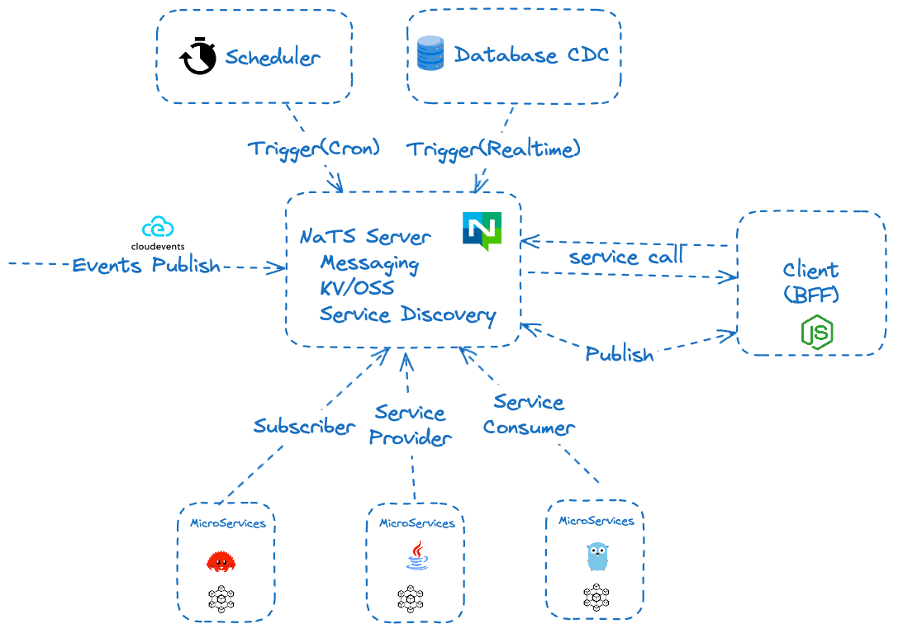

Spring Boot Starter NATS
===========================
Spring Boot 2.x/3.x starter for NATS with Publish/Subscribe, Services Framework, JetStream KV watch support.



# Why Spring Boot starter for NATS?

NATS is very simple, why you create a starter for Spring Boot?

* Nats Microservices framework support: RPC style
* JetStream KV watch support: Durable Component
* NATS service interface: almost alike Spring HTTP interface to make service call easy
* Spring Kafka like: `@NatsSubscriber` to listen subject
* Subject for instance only: make A/B easy
* Metrics & endpoints: NATS states
* Health indicator for NATS

# Get Started with Publish/Subscribe

* please add following dependency in your pom.xml

```xml

<dependency>
    <groupId>org.mvnsearch.spring.boot</groupId>
    <artifactId>nats-spring-boot-starter</artifactId>
    <version>1.0.0-SNAPSHOT</version>
</dependency>
```

* please add setting in application.properties. For cluster, please change url to "nats://host1:4222,nats://host2:4222"

```
nats.spring.server = nats://localhost:4222
```

* in you code, use autowired NATS Connection to send message

```
   @Autowired
   private Connection nc;
   ...
   nc.publish("subject1","hello".getBytes());
```

* @NatsSubscriber support, method signature of subscriber is `"(Message)->void"`

```
    @NatsSubscriber(subject = "topic.a")
    public void handler(Message msg) {
}
```

### Subject for App Instance only

Every app instance will listen a subject, such as `app-name-75454360-49f0-4609-9ed9-1e3bef4219cc`(print on console),
and you can send the messages to this subject and communicate with this instance only.

It's easy and simple, and you can use `AppInstanceOnlyMessageHandler` interface to handle the message.

```java

@SpringBootApplication
public class NatsDemoApplication implements AppInstanceOnlyMessageHandler {

    public static void main(String[] args) {
        SpringApplication.run(NatsDemoApplication.class, args);
    }

    @Override
    public void onMessage(Message msg) throws InterruptedException {
        System.out.println("Received message from:" + msg.getSubject());
    }
}
```

Some use cases for this feature:

* Peer-to-Peer communication: send messages to a specific instance.
* A/B testing: send the message to a specific instance, and not broadcast to all instances.

### Reactive support

If you want to use Reactive style, and you can use `NatsReactive` bean, and interface as following:

```java
public interface NatsReactive {

    Mono<Void> publish(String subject, byte[] body);

    Flux<byte[]> subscribe(String subject);
} 
```

# NATS MicroServices framework

[NATS Services Framework](https://natsbyexample.com/examples/services/intro/java) is MicroServices RPC framework with Service Discovery support,
and you can check [NATS Service API Spec](https://github.com/nats-io/nats-architecture-and-design/blob/main/adr/ADR-32.md) for detail.

### How to publish NATS MicroServices?

In the server side, create a normal Spring Boot controller with `@MessageMapping` and `@NatsService` annotations.

```java

@Controller
@MessageMapping("minmax")
@NatsService(name = "minmax", version = "0.0.1", description = "min/max number service")
public class UserNatsService {

    @MessageMapping("min")
    public int min(ServiceMessage msg) {
        int min = Integer.MAX_VALUE;
        String[] input = new String(msg.getData()).split(",");
        for (String n : input) {
            min = Math.min(min, Integer.parseInt(n));
        }
        return min;
    }
}
```

After server started, and you can use `nats micro ls` to check services, and use `nats request minmax.min "1,2"` to make a test.

### How to consume NATS MicroServices?

In the client side, create an interface with `@NatsExchange` and add methods with `@ServiceExchange` annotations.

```java

@NatsExchange
public interface UserService {

    @ServiceExchange("minmax.min")
    Mono<Integer> min(String text);
}
```

Then to build service stub proxy to call the service.

```java
public class UserServiceTest {

    @Test
    public void testServiceCall() throws Exception {
        Connection nc = Nats.connect("nats://localhost:4222");
        UserService userService = NatsExchangeProxyFactory.buildStub(nc, UserService.class);
        Integer min = userService.min("1,2").block();
        System.out.println(min);
    }
}
```

**Attention**: NATS MicroServices frameworks is based on `request-reply` model, and it is async mode, and you need to use Reactive `Mono` to handle the result.

### Object serialization for NATS Services

Now only json support, and more serialization support will be added in the future.

* Protobuf: native and protostuff https://developers.google.com/protocol-buffers/
* Avro: https://avro.apache.org/ Kafka Schema
* CBOR: http://cbor.io/
* MessagePack: https://msgpack.org/

# Durable Component

Durable component is almost like [Cloudflare Durable Objects](https://developers.cloudflare.com/durable-objects/),
and you can use NATS JetStream KV watch to sync states between instances.

```java

@Component
@NatsDurableComponent
public class OnlineUserComponent {
    private static final Logger logger = LoggerFactory.getLogger(OnlineUserComponent.class);
    private int onlineUserCount;

    @NatsKeyWatcher(bucket = "bucket", key = "online.user.count")
    public void setOnlineUserCount(int count) {
        logger.info("Online user count: " + count);
        this.onlineUserCount = count;
    }
}
```

After `bucket/online.user.count` key changed, the `setOnlineUserCount` method will be called to sync the state between instances.

**Tips**: If you have a state with many fields, and you can use JavaBean or `record` as fields.
Then call `nats kv put bucket online.admin '{"nick": "linux_china", "phone":"138xxx"}'` to update JavaBean state.

# References

* NATS:  https://nats.io/
* NATS Docs: https://nats-io.github.io/docs/
* NATS Architecture and Design Docs: https://github.com/nats-io/nats-architecture-and-design
* NATS Java client: https://github.com/nats-io/java-nats
* Method Handles in Java: http://www.baeldung.com/java-method-handles
